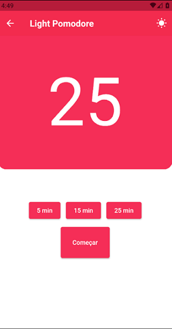
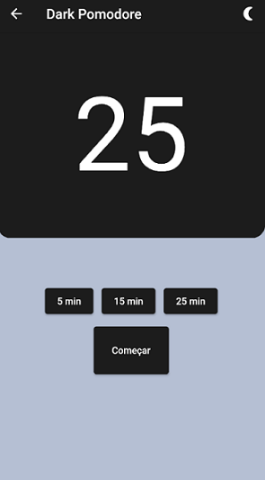
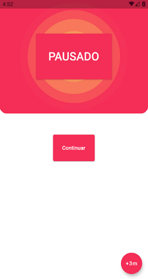

<h1 align="center">
    <a href="https://flutter.dev/"> Flutter</a>
</h1>

 Um app de pomodoro em Flutter

<b>Caracteristicas:</b>

- [x] Esolha de timer de 5, 15 ou 25 minutos
- [x] Possibilidade de adicionar mais tempo de 3 em 3 minutos em timers em andamento
- [x] Pausar e continuar
- [x] Pausas de 5 minutos com opção de aumentar de 3 em 3 minutos
- [x] Modo noturno
- [x] Animação de funcionamento
- [ ] Alguns ajustes de desempenho

  <b>Getting Started</b>

- Get Flutter <a href="https://flutter.dev" rel="nofollow">here</a> if you don't already have it
- Clone this repository.
- cd into the repo folder.
- run flutter run-android

<b>Technologies:</b>

 -[Flutter] (<a href="https://flutter.dev" rel="nofollow">https://flutter.dev</a>) 
 -[Android SDK] (<a href="https://developer.android.com/studio" rel="nofollow">https://developer.android.com/studio</a>) 
 -[Dart] (<a href="https://dart.dev" rel="nofollow">https://dart.dev</a>)
 

<b>Screenshots:</b>

 <table style="width:100%">
  <tr>
    <td><h1 align="center">
  
</h1></td>
    <td><h1 align="center">
  
</h1></td> 
    </tr>
      <tr>
    <td><h1 align="center">
   width="295" height="553" />
</h1></td>
           <td><h1 align="center">
   width="295" height="553" />
</h1></td>
  </tr>
      <tr>
    <td><h1 align="center">
   width="295" height="553" />
</h1></td>
           <td><h1 align="center">
   width="295" height="553" />
</h1></td>
  </tr>
 </table>
 
 
### Author
---

 
 
  

Este projeto esta sobe a licença <a href="https://https://github.com/adrienschmitz/pomodore_timer/blob/master/LICENSE">MIT</a>
